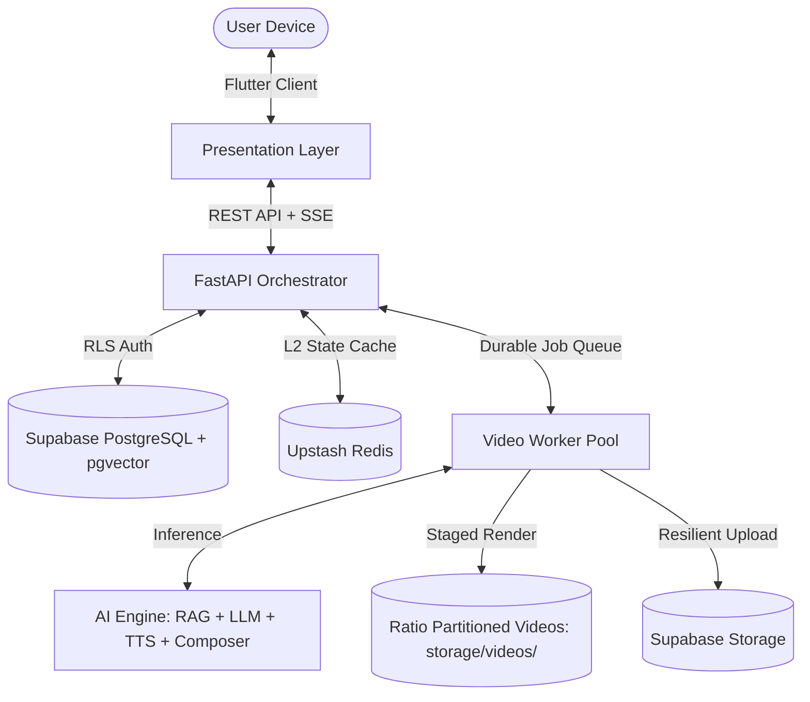

# Software Requirements Specification (SRS)
## MemoryVerse: Conversational AI Memory Director & Multimodal Video Platform

**Standard Compliance**: ISO/IEC/IEEE 29148:2018 / IEEE Std 830-1998  
**Document Version**: 2.4.0  
**Status**: Approved & Verified  
**Date**: September 2026  

---

## 1. Introduction

### 1.1 Purpose
This document specifies the software requirements for **MemoryVerse**, a privacy-first, collaborative, emotion-aware, multimodal memory journaling and conversational video generation platform. It defines functional requirements, external interfaces, non-functional constraints, privacy and consent workflows, and the verification matrix.

### 1.2 Document Conventions
- **SHALL / MUST**: Mandatory requirements that must be met and verified.
- **SHOULD**: Strongly recommended capabilities.
- **MAY**: Optional or future roadmap capabilities.
- **Requirement Identifiers**:
  - `REQ-FUNC-XXX`: Functional requirements
  - `REQ-PRIV-XXX`: Privacy, consent, and safety requirements
  - `REQ-PERF-XXX`: Performance and latency requirements
  - `REQ-SEC-XXX`: Security and multi-tenancy requirements

### 1.3 Intended Audience
This specification is intended for software engineers, AI/ML researchers, system architects, QA verification engineers, security officers, and product managers.

### 1.4 Project Scope
MemoryVerse eliminates the cognitive friction of manual photo and video curation by providing an intelligent **AI Memory Director**. The platform:
1. Performs private on-device discovery and multimodal indexing across personal camera rolls.
2. Implements a transparent **3-Moment Trust & Consent Protocol** separating on-device exploration from cloud sharing.
3. Automatically excludes sensitive documents, screenshots, and receipts.
4. Engages in multi-turn conversational dialogue to steer narrative storyboards and video specifications.
5. Synthesizes zero-distortion, cinematic video reels aligned with target durations ($\pm 0.3$s).
6. Delivers dual in-app and device offline storage partitioned by aspect ratio (`storage/videos/{ratio}/`), complete with universal MP4 sharing.

### 1.5 References
- IEEE Std 830-1998: *IEEE Recommended Practice for Software Requirements Specifications*.
- ISO/IEC/IEEE 29148:2018: *Systems and software engineering — Life cycle processes — Requirements engineering*.
- Regulation (EU) 2016/679 (General Data Protection Regulation - GDPR), Articles 6, 9, 17.
- California Consumer Privacy Act (CCPA) / California Privacy Rights Act (CPRA).
- Illinois Biometric Information Privacy Act (BIPA), 740 ILCS 14/.

---

## 2. Overall Description

### 2.1 Product Perspective
MemoryVerse consists of three tightly integrated tiers:
1. **Presentation Tier (Flutter)**: Cross-platform client for iOS, Android, and Desktop providing a dark, ambient aesthetic, real-time SSE progress streaming, and conversational AI direction.
2. **Backend Orchestration Tier (FastAPI)**: Python service managing asynchronous durable queues, Supabase database synchronization, Upstash Redis caching, and media streaming.
3. **AI Cognitive Processing Tier (AI Engine)**: Microservice suite coordinating dense/sparse embeddings (BGE-M3, SigLIP, CLIP), LLM reasoning (Gemini / OpenRouter), Edge-TTS neural speech synthesis, and MoviePy / FFmpeg video rendering.

### 2.2 User Classes and Characteristics
- **Personal Memory Chronicler**: Individuals seeking to preserve travel, family, and daily milestones without manual video editing friction.
- **Collaborative Group Vault Members**: Friends or family members sharing selected assets into a private, shared vault.
- **Privacy-Sensitive Users**: Users with strict camera roll privacy concerns requiring guaranteed on-device scanning boundaries.

### 2.3 Operating Environment
- **Mobile**: Android 10+ (API Level 29+), iOS 15+.
- **Desktop / Web**: Windows 11, macOS 13+, Linux (Ubuntu 22.04 LTS), Modern Chromium/WebKit browsers.
- **Backend Infrastructure**: Linux x86_64 / ARM64 container runtime with Python 3.11+, FFmpeg 6.0+, Libavcodec, and NVIDIA CUDA (optional for GPU acceleration).

---

## 3. Specific System Requirements

### 3.1 External Interface Requirements

#### 3.1.1 User Interfaces
- **REQ-UI-001**: The client SHALL provide an `AiDirectorScreen` presenting a conversation transcript, active video specification preview chips, inline progress indicator, and an illuminated input bar.
- **REQ-UI-002**: The chat input SHALL include a circular `+` button allowing direct selection of local device media via `image_picker` with a horizontal thumbnail preview strip.
- **REQ-UI-003**: The client SHALL display dynamic contextual suggestion chips exclusively beneath the latest assistant response.
- **REQ-UI-004**: The conversation transcript SHALL automatically and smoothly scroll to the bottom upon message dispatch, assistant reply arrival, and video progress milestones.
- **REQ-UI-005**: When `AiDirectorScreen` is active, the root floating `VideoJobBanner` SHALL be suppressed to prevent duplicate progress bars.

#### 3.1.2 Software & Storage Interfaces
- **REQ-INT-001**: The system SHALL provide `GET /api/v1/media/videos/{job_id}/download` returning the locally preserved MP4 with `Content-Disposition: attachment`.
- **REQ-INT-002**: Rendered videos SHALL be deterministically stored on the server under `storage/videos/{ratio_slug}/{filename}`.

---

### 3.2 System Features & Functional Requirements

#### Feat-01: Multimodal Media-Access RAG & Hybrid Indexing
- **REQ-FUNC-101**: The system SHALL extract EXIF timestamps, GPS coordinates, scene tags, and dense visual embeddings from media assets.
- **REQ-FUNC-102**: Initial media filtering and candidate scoping SHALL occur locally on-device. Raw media files SHALL NOT be uploaded to cloud storage until the user confirms selection for a memory.
- **REQ-FUNC-103**: Query retrieval SHALL perform cosine similarity scoring against precomputed SigLIP and BGE-M3 representations filtered strictly by `user_id`.

#### Feat-02: The 3-Moment Trust & Consent Protocol
- **REQ-PRIV-201 (Moment 1 - Media Permission)**: Prior to scanning, the application SHALL display explicit on-device disclosure copy:
  > *"MemoryVerse can look through your photos and videos to find moments that match what you're creating — so you don't have to hunt for them yourself. This scan happens on your device; nothing is sent anywhere unless you choose to add it to a memory. You can allow full access, select specific albums, or skip this and upload manually."*
- **REQ-PRIV-202 (Moment 2 - Scope Confirmation)**: Following a query prompt, the system SHALL inform the user of the asset pool size and request confirmation before running deep analysis:
  > *"Looking for clips matching '[Prompt]'... Found [X] photos and [Y] videos from that time. Want me to look through these for the best matches?"*
- **REQ-PRIV-203 (Moment 3 - Shared Memory Boundary)**: Whenever media is added to a multi-user vault or collaborative memory, the client SHALL display an explicit boundary warning:
  > *"Adding [X photos, Y videos] to '[Memory Name]' — visible to [Collaborator Names] and anyone else invited. Everything else in your library stays private to you."*

#### Feat-03: Sensitive Content & Document Exclusion
- **REQ-PRIV-301**: The media intelligence engine SHALL detect and exclude screenshots, receipts, invoices, tax documents, passports, identity cards, and NSFW images from the storytelling candidate pool by default.
- **REQ-PRIV-302**: An asset SHALL only be included if the user explicitly overrides the filter via manual selection.

#### Feat-04: Conversational AI Memory Director
- **REQ-FUNC-401**: The director service SHALL answer natural language Q&A regarding memory contents, including exact counts of photos and videos (e.g. *"This memory contains 3 photos and 1 video (4 moments total)"*), dates, locations, and detected emotions.
- **REQ-FUNC-402**: The director service SHALL parse user mutation requests (e.g. *"make it 20s"*, *"switch to 9:16 portrait"*, *"acoustic music"*, *"high quality export"*) and update the `VideoSpecification` deterministically without unnecessary LLM hallucination.

#### Feat-05: Emotion-Aware Video Synthesis & Zero-Distortion Composition
- **REQ-FUNC-501**: The video renderer SHALL NOT stretch or warp media to match a target aspect ratio.
- **REQ-FUNC-502**: When source aspect ratio differs from target aspect ratio, `AspectRatioComposer` SHALL fit the media with native proportions and render an adaptive Gaussian-blurred background derived from the source media.
- **REQ-FUNC-503**: The rendering pipeline SHALL support `16:9` (1280x720 / 1920x1080), `9:16` (720x1280 / 1080x1920), `1:1` (720x720 / 1080x1080), and `4:3` (960x720 / 1440x1080).

#### Feat-06: Theatrical Intro Title Synthesis & Duration Synchronization
- **REQ-FUNC-601**: The system SHALL use Gemini / LLM to transform user queries (e.g. *"Create A Memory Filtering The Images Where There Is Water In It"*) into concise cinematic titles (e.g. *"Water Reflections"*) and poetic taglines (*"Echoes of light and serene waters"*).
- **REQ-FUNC-602**: The intro title card SHALL render for 2.5 seconds with an animated Ken Burns zoom, warm radial spotlight glow, floating golden bokeh sparkles, frosted glass badge, center gold diamond ornament, and triple-layer title typography.
- **REQ-FUNC-603**: Total video duration SHALL strictly align with requested target duration within $\pm 0.3$ seconds by deducting title card (2.5s) and outro card (1.5s) from available scene budgets and normalizing individual scene lengths.

#### Feat-07: Humanized Neural Voiceover & Sidechain Audio Ducking
- **REQ-FUNC-701**: Narration SHALL be synthesized using warm neural voices (`en-US-ChristopherNeural`, `en-US-AndrewNeural`, `en-US-JennyNeural`).
- **REQ-FUNC-702**: During active speech playback, background music volume SHALL be dynamically attenuated by -14 dB using a smooth 200ms sidechain ducking curve.

#### Feat-08: Dual-Tier Offline Download & Direct File Sharing
- **REQ-FUNC-801**: Tapping the in-app Download button SHALL download and store the video in both the app documents directory and the device's public offline Movies/Videos folder (`/storage/emulated/0/Movies` on Android or system Downloads).
- **REQ-FUNC-802**: Tapping the Share button SHALL invoke `Share.shareXFiles([XFile(localPath)])` to transmit the **actual MP4 video file** directly to external applications.
- **REQ-FUNC-803**: Rendered video files SHALL be encoded with universal `-movflags +faststart` and standard H.264/AAC codecs.

#### Feat-09: Selective Invalidation Revision Engine (DAG)
- **REQ-FUNC-901**: Revisions to existing videos SHALL execute against a directed acyclic graph (DAG) of the 12 pipeline stages. Changing music style SHALL invalidate only audio synthesis and final encoding, reusing cached storyboard and scene composites.

---

### 3.3 Non-Functional Requirements

#### 3.3.1 Performance Requirements
- **REQ-PERF-001**: Conversational Q&A responses in `AiDirectorScreen` SHALL return with P95 latency $< 800\text{ ms}$.
- **REQ-PERF-002**: Video generation progress reporting SHALL advance monotonically from 0% to 100% across normalized stages without jitter or backward movement.
- **REQ-PERF-003**: 20-second video renders on Fast preset SHALL complete in $< 10\text{ seconds}$ on standard cloud compute instances.

#### 3.3.2 Security & Multi-Tenancy Requirements
- **REQ-SEC-001**: Every API endpoint SHALL validate user identity via Supabase JWT.
- **REQ-SEC-002**: Tenant isolation SHALL be strictly enforced: User A SHALL NEVER access User B's memories, media assets, vector embeddings, staged video files, or active jobs.
- **REQ-SEC-003**: API keys and cloud credentials SHALL NEVER be logged or exposed to client-side code.

#### 3.3.3 Reliability & Resilience Requirements
- **REQ-REL-001**: Rendered video files SHALL always be staged to local disk prior to cloud upload.
- **REQ-REL-002**: If cloud upload fails due to network interruption, the local file SHALL be preserved and retried without re-rendering.
- **REQ-REL-003**: Background workers SHALL emit heartbeats every 10 seconds. Jobs abandoned by dead workers SHALL be recovered and resumed from the last checkpoint.

---

## 4. Verification & Traceability Matrix

| Requirement ID | Requirement Description | Verification Method | Automated Test Suite Reference |
|---|---|---|---|
| `REQ-FUNC-101` | Multimodal embedding extraction | Automated Test | `ai_engine/test/test_agents.py::test_video_synthesis_agent_pipeline` |
| `REQ-FUNC-401` | Conversational Q&A for media counts | Unit & Integration Test | `backend/tests/test_ai_director.py::test_ai_director_conversational_qa_and_storage` |
| `REQ-FUNC-402` | Natural language specification mutations | Unit Test | `backend/tests/test_ai_director.py::test_ai_director_mutations` |
| `REQ-FUNC-501` | Zero-distortion aspect ratio composition | Unit Test | `backend/tests/test_ai_director.py::test_aspect_ratio_composer_guarantees` |
| `REQ-FUNC-503` | Support for 16:9, 9:16, 1:1, and 4:3 | Unit Test | `backend/tests/test_ai_director.py::test_target_aspect_ratio_dimensions` |
| `REQ-FUNC-601` | Gemini cinematic title & tagline synthesis | Integration Test | `backend/tests/test_ai_director.py::test_cinematic_title_synthesis_and_intro_card` |
| `REQ-FUNC-603` | Strict duration alignment ($\le \pm 0.3\text{s}$) | Pipeline Test | `backend/tests/test_video_pipeline.py::test_adaptive_scene_scaling` |
| `REQ-FUNC-701` | Warm human neural narration (Edge-TTS) | Unit Test | `ai_engine/test/test_agents.py::test_tts_neural_voice_agent` |
| `REQ-FUNC-702` | Sidechain audio ducking (-14 dB) | Unit Test | `backend/tests/test_video_pipeline.py::test_audio_ducking_calculations` |
| `REQ-FUNC-801` | Dual in-app & offline ratio storage | Unit Test | `backend/tests/test_ai_director.py::test_ai_director_conversational_qa_and_storage` |
| `REQ-FUNC-802` | Direct MP4 file sharing | Widget Test | `frontend/test/widget_test.dart` |
| `REQ-FUNC-901` | Selective invalidation revision DAG | Unit Test | `backend/tests/test_ai_director.py::test_revision_engine_dag` |
| `REQ-PRIV-201` | Moment 1 on-device consent disclosure | Widget Test | `frontend/test/widget_test.dart::MediaPermissionView renders successfully` |
| `REQ-PRIV-301` | Sensitive document exclusion filter | Unit Test | `backend/app/services/media_intelligence.py` |
| `REQ-SEC-002` | Strict multi-tenant isolation | Security Integration Test | `backend/tests/test_api.py::test_tenant_isolation_boundary` |
